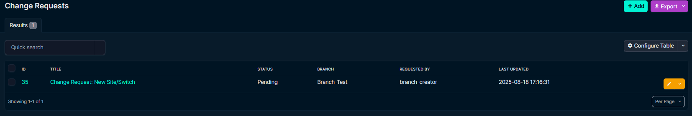
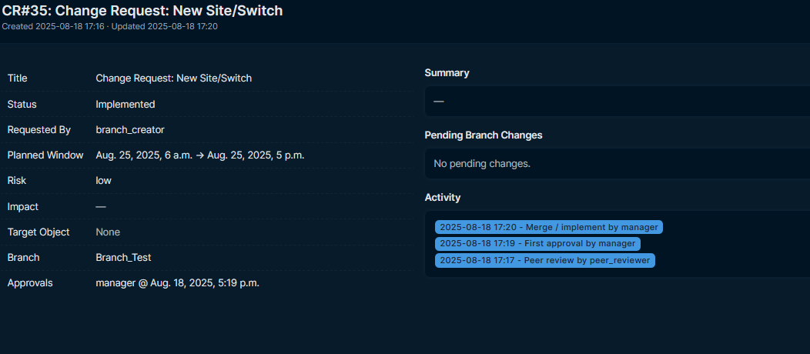
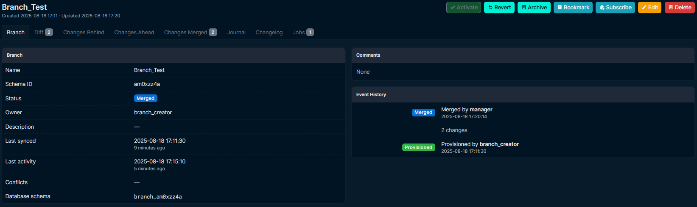

# Netbox-Branch-Review
Branch-aware change request & approval workflow for NetBox that can gate branch merges until a Change Request (CR) is approved.

## Requirements
- NetBox 4.x
- Netbox-Branching plugin for branch operations (the merge gate integrates with it)
- Python 3.10+

## Installation
1) Install the plugin:
```sh
pip install netbox-branch-review 
```

2) Enable in NetBox configuration.py:
```python
PLUGINS = [
    "netbox_branch_review",
    "netbox_branching",
]

PLUGINS_CONFIG = {
    "netbox_branch_review": {
        # Require two approvals before merge (default: True)
        "require_two_approvals": True,
        # Enforce branching integration (default: True)
        "enforce_branching": True,
    # Approval implies branch changes are acceptable; merge button appears once approved.
    }
}
```

3) Migrate:
```sh
python manage.py migrate
```

4) Restart NetBox.

### Quick Start (Groups & Permissions)
Run the management command to create/sync default groups and permissions:
```bash
python manage.py sync_change_review
```
This will ensure:
- Group "Change Managers" gets approve / merge / peer review permissions.
- Group "Change Reviewers" gets only the peer review permission.

Customize names:
```bash
python manage.py sync_change_review --managers "My Managers" --reviewers "My Reviewers"
```
Skip peer group creation:
```bash
python manage.py sync_change_review --no-peer-group
```

## Usage
- Create a new branch as usual, make required new changes
- Navigate to Branch Review > Change Management
- Create a CR
- From the CR page, you can Review & Merge the CR, and then merge the branch

### Approval and Peer Review

How it works:
- Two approval mode (default): two distinct approvals are required. If `allow_self_full_approval` is enabled, the CR creator with approval permission may record both levels in one action; both levels are audited.
- Single approval mode: one approval is enough; repeated approvals by the same user are blocked.
- Peer review: users with `peer_review_changerequest` can record a peer review for audit and visibility only; it does not change the CR status.
- Merge: performing a merge sets the CR status to `Implemented`.

Validation:
- The merge gate (`require_cr_approved_before_merge` validator) enforces the configured number of approvals and requires the CR status be `Approved` or `Scheduled` before allowing a merge.

Notes:
- Approvals submitted after final approval or duplicate attempts are logged and ignored.
- Revokes are possible before implementation (see Revoking Approvals).

## Permissions & Suggested Groups
Custom permissions defined on the model: [`ChangeRequest.Meta.permissions`](netbox_branch_review/models.py)

| Codename                  | Purpose                                        |
| ------------------------- | ---------------------------------------------- |
| approve_changerequest     | Perform L1/L2 approvals (depending on config)  |
| merge_changerequest       | Execute merge / implement action               |
| peer_review_changerequest | Record a peer review (no status change)        |
| revoke_changerequest      | Revoke existing approvals (pre-implementation) |

Because NetBox’s Group UI currently only lists standard model permissions in the multiselect, custom codenames may not appear for manual selection. The plugin’s `post_migrate` hook ensures they are created; you can assign them via shell if needed.

Suggested groups:
- Change Managers: `approve_changerequest`, `merge_changerequest` (optionally also `peer_review_changerequest`).
- Change Reviewers: `peer_review_changerequest` (and `view_changerequest` if not already provided globally).

Example shell assignment:
```bash
python manage.py shell -c "from django.contrib.auth.models import Group,Permission; mgr,_=Group.objects.get_or_create(name='Change Managers'); rev,_=Group.objects.get_or_create(name='Change Reviewers'); mgr.permissions.add(*Permission.objects.filter(codename__in=['approve_changerequest','merge_changerequest','peer_review_changerequest'])); rev.permissions.add(Permission.objects.get(codename='peer_review_changerequest'))"
```

Check a user’s effective perms:
```bash
python manage.py shell -c "from django.contrib.auth import get_user_model; u=get_user_model().objects.get(username='alice'); print([p for p in sorted(u.get_all_permissions()) if p.startswith('netbox_branch_review.')])"
```

### Revoking Approvals
Users with `revoke_changerequest` can revert a Change Request back to Pending (prior to implementation). This:
1. Creates audit entries for each revoked level (L2 then L1) plus a summary revoke_full entry.
2. Clears `approver_1`, `approver_2` and their timestamps.
3. Sets status to `pending`.

Limitations:
- Can't revoke after status reaches Implemented.
- Self full approvals (implicit level 2) will be fully cleared in one revoke action.

UI: A Revoke Approvals button appears when (a) the user has the permission, (b) the CR isn't implemented, and (c) at least one approval exists.

## API
- Serializer: [`ChangeRequestSerializer`](netbox_branch_review/api/serializers.py)
- ViewSet: [`ChangeRequestViewSet`](netbox_branch_review/api/views.py)

Note: Expose routes via the NetBox plugin API router as needed. The serializer exposes all CR fields, including ticket.

## Layout

   
*Change Request Creation.*

   
*View list of CRs.*

   
*Manager Approval.*

   
*Completed CR.*

   
*Completed Branch Merge.*

## Notes
- The plugin registers the merge gate during `ready()` by calling `register_pre_merge_validator()` if available (see [`__init__.py`](netbox_branch_review/__init__.py)). If the branching plugin is not present, merge enforcement gracefully no-ops, and UI will warn when branch data
- Default groups may also be auto-created during `post_migrate` based on plugin settings (see `__init__.py` and `signals.py`), but the management command provides a clear, repeatable onboarding step.