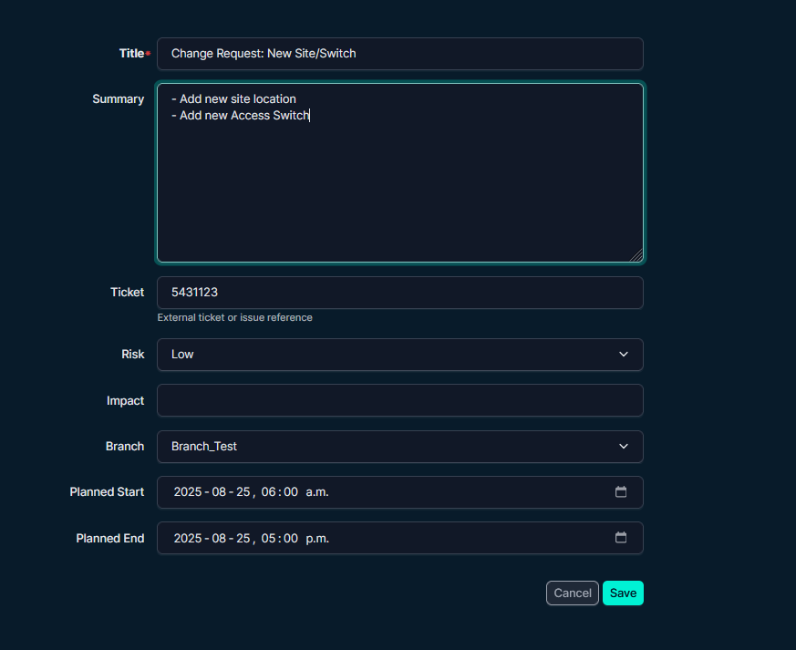
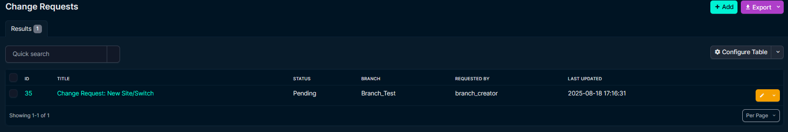
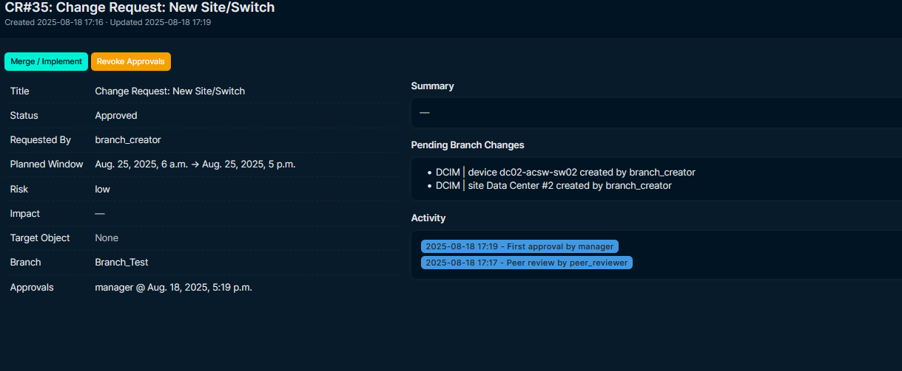
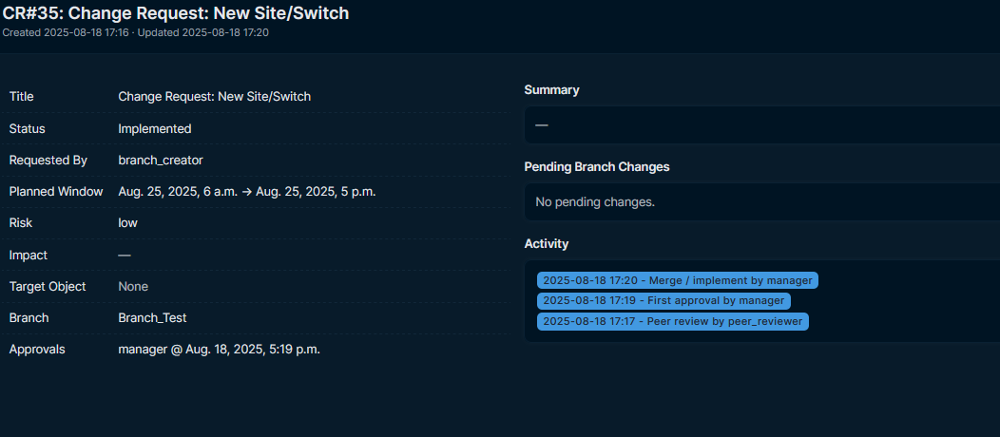
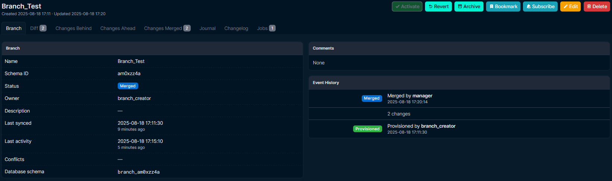

# NetBox Branch Review — Example

## 1) Create a Change Request
Only Title and Summary are needed; Requested by is optional/auto.

## 2) Browse the list
See status and who approved.

## 3) Approve
Click Approve (peer approval may be required depending on config).

## 4) Merge / Implement
When approved and a branch is attached, select Merge / Implement.

## Optional: Branch view
If you work directly with branches, you’ll see it merged as well.

Tips
- Configure `require_two_approvals` and `allow_self_full_approval` in `PLUGINS_CONFIG`.
- The Branching plugin validator can enforce approval before merges.
